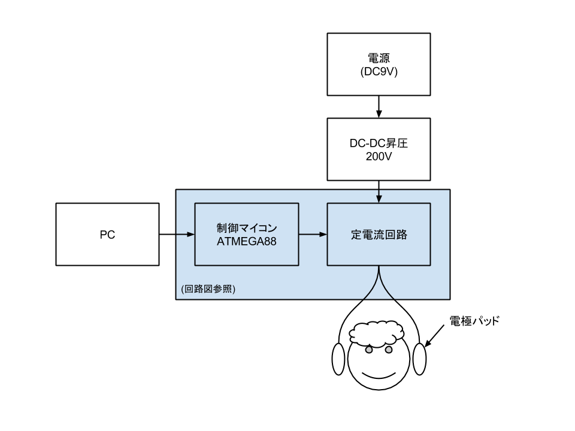
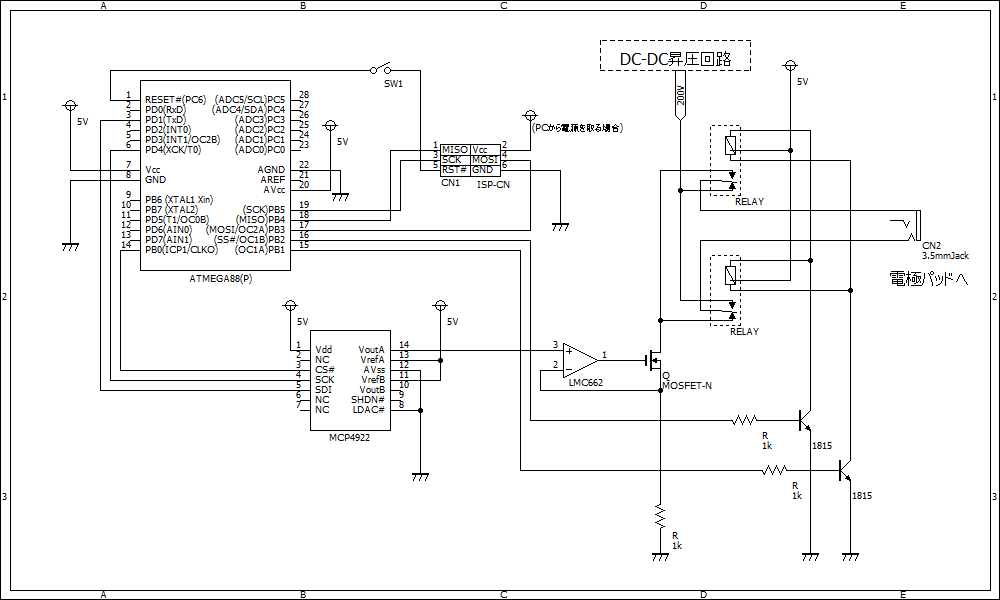

# 前庭電気刺激(GVS)実験用

前庭電気刺激(GVS)の実験用リポジトリ．

**ここに書かれていることを実践した結果生じるいかなる損害に対しても責任は負えません．十分注意し，自分の責任でご利用下さい．**

耳の後ろ辺りに電極パッドを貼り付けて頭に電流を流すと加速度を感じます．

比較的危険は少ない内容ですが，電気の事故は生命に関わる場合もあるため，よく理解した上で遊びましょう．




## 回路





| 部品名                 | 購入場所 | 価格(円) | 備考・URL                              |
| ---------------------- | -------- | -------- | -------------------------------------- |
| オムロン 電極パッド    | Amazon   |    1,345 | http://www.amazon.co.jp/dp/B0002ERMBE  |
| DC-DC昇圧回路          | aitendo  |      600 | http://www.aitendo.com/product/6872    |
| MOSFET 2SK3234         | 秋月     |      200 | 耐圧とゲート・ソース間電圧に注意       |
| OPアンプ LMC662CN      | 秋月     |      150 | フルスイング出力可能なもの             |
| D/Aコンバータ MCP4922  | 秋月     |      200 | SPIなのでマイコンと接続が楽です        |
| AVR ATMEGA88           | 秋月     |      170 | SPIで通信できるお好きなマイコンでOK    |
| 2c接点ラッチングリレー | 鈴商     |     不明 | 5Vで動作するもの                       |

注：価格は参考です

- [Amazon](http://www.amazon.co.jp/)
- [Aitendo](http://www.aitendo.com/)
- [秋月](http://akizukidenshi.com/)
- [鈴商](http://www.suzushoweb.com/)


回路図上ではATMEGA88を使っていますが，MCP4922とSPIで通信できて，リレーを制御するIOが2本あれば，お好きなマイコンやArduino等が利用可能です．


[circuit.ce3](circuit/circuit.ce3) は水魚堂のBSch3V用です.


## ファームウェア

Arduinoでも大丈夫だと思いますが，試してません．(Arduinoの場合はTx/RxはPCとの通信に使うのでSPI用端子使った方が便利そうです)


AVR向けのクロスコンパイル環境が必要です．

- Windows: WinAVR http://winavr.sourceforge.net/
- MacOSX: CrossPack for AVR https://www.obdev.at/products/crosspack/index.html
- その他 gccを良しなにビルド


``` bash
cd firmware
make
make write # 何らかのAVRプログラマを用意してください
```

test_da.hexを実行すると，Ipp=±2mAな三角波が出力されます．


## TODO

- Arduino Uno向けサンプルを追加
- Androidアプリ, Oculus Rift
- 非絶縁なので複数同時に使えないのを解決

## 宣伝


より詳細な解説や製作記は，コミックマーケット88で頒布予定の「ななかInside PRESS vol.7」を御覧ください．

https://sites.google.com/site/dai7sec/


## 参考資料

　大阪大の[前田研究室](http://www-hiel.ist.osaka-u.ac.jp/japanese/exp/gvs.html)の解説はGVSについて理解するのに役立ちました．また，todesking氏の[人体に電流を流すためのハードウェアを作る](http://www.todesking.com/hitosinigaderu/)記事は回路の作成にあたって参考にしています．低周波治療器用の電極使うアイディアもここから得ました．ありがとうございます．

## License:

- MIT License

